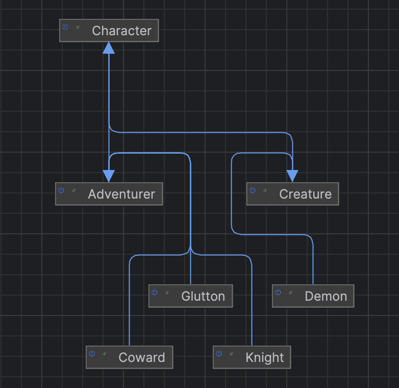
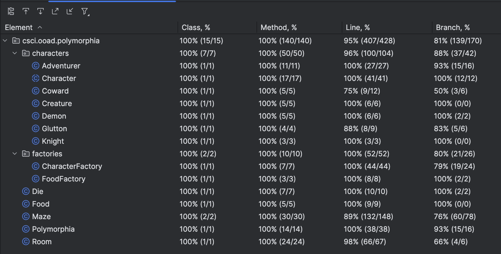

## Adding the Factory and Builder Patterns

### Introduction
    Team Members: Grace Ohlsen, Nolan Brady, Sierra Reschke
    Java Version: 21
### Comments/Assumptions:

    // Coward: order of action is fight Demon, flee from Creature, eat, move (if no creatures/demons present)
    //      i.e. the coward will flee before eating if there is a Creature present

    // Adventurer will fight even if Knight is in room (since Adventurer has higher health)

    // Adventurer will only fight the Demon even if a Demon and a creature are Present

    // Glutton will continue eating food while food is present in the room

### UML Diagram


### Game play files
The game files can be found in the main directory. They are named `./polymorphia_game_play_1.log`, `./polymorphia_game_play_2.log` and `./polymorphia_game_play_3.log`.

### Test Coverage


### Required Capabilities

* Add a screenshot of your code coverage to your README.md (5 points)
* Add the output from three games into your README.md (5 points)
* Add a UML Diagram of your classes (don’t include Builder or Factories) into your README.md   (5 points)
* Game extensions (5 points for each new subclass - 20 total points)
* Use Builder pattern for creating the maze (14 points for required capabilities and 6 points for method construction - 20 total points)
* Use the Factory pattern in your Maze.Builder class (12 points creating required concrete classes and 3 points for method construction - 15 total points)

## Extending the Game
This extension of the game makes it more interesting and implements the Factory pattern.

First, create a new subclass of your Creature class:

    Demon:
        - always fight an adventurer and an adventurer cannot run away from a demon.
        - if there are multiple adventurers in the room, the Demon fights them all.
        - initial health score: 15

Next, create three new subclasses of your Adventure class:

    Knight:
        - always fights any Creature in the room
        - initial health score: 8

    Coward:
        - always runs from a creature, if it can (it can’t run from Demons)
        - initial health score: 5
        - loses 0.5 points whenever it runs from a Creature (this is in place of the usual 0.25 move penalty)
    
    Glutton:
        - always eats if food is available unless a Demon is in the room, then it must fight.
        - initial health score: 3

When you write tests for your game, you can include any number of Knights, Cowards, Gluttons, regular Adventurers, regular Creatures, and Demons. Try out various combinations on different-sized mazes with different amounts of food. Just explore the space. Make sure one test has at least one of all these characters, though.

## Adding the Builder Pattern to the Maze Class

The Maze is by far the most complicated object in our game. There are so many different
ways that we might create it, including:

* the number of rooms
* how the rooms are connected
* how many adventurers, creatures, and food items are in the maze
* how the above items are distributed in the maze

Creating multiple constructors for such an object isn't very clean and would require
an incredible explosion of constructor methods. Instead, you'll use the Builder pattern.

Follow the lecture discussion and notes on implementing this pattern, including:

* make the Maze constructor private
* create a static inner class for the builder:

```java
public static class Builder {
    ...
}
```

* create a static method on the Maze class to return an instance of the Builder:

```java
public static Builder getNewBuilder() {
    return new Builder();
}
```

Yes, the Maze class uses the _new_ keyword here and is tightly coupled to 
the Builder class, but that's okay, as it is already and purposely coupled to
this class as an Inner Class. 

The builder should be able to do all these things (2 points each):

* Create a 2x2 grid layout maze (this can be hard-coded, but better to create a method that constructs a "grid-layout" maze of N rows and M columns) – you should already have this code.
* Create a 3x3 grid layout maze - you should already have this code.
* Create a maze with n rooms where all rooms are fully connected – each room connected to every other room.
* Able to create and add any number of creatures, adventurers, and food items and distribute them to rooms.
* Add a method to the builder that changes the distribution from random to sequentially distribution.
* Ability to add a single room with a name.
* Ability to place an object (Adventurer, Creature, or Food) into a specific room (identified by the name of the room) – very useful for testing.

Here are a couple of tests to further flesh out how the random/sequential distribution should work:

```java

@Test
void testSequentialDistribution() {
    Maze maze = Maze.newBuilder()
        .createNFullyConnectedRooms(4)
        .distributeSequentially()
        .createAndAddFoodItems("hot dog", "popcorn", "chili dog", "Coke")
        .build();
    
    // Since we added four food items into a four-room maze, with sequential distribution, each room should have some food.
    for (Maze.Room room : maze.getRooms()) {
        assertTrue(room.hasFood());
    }
}

@Test
void testRandomDistribution() {
    Maze maze = Maze.newBuilder()
        .createNFullyConnectedRooms(10)
        .distributeRandomly()
        .createAndAddFoodItems("hot dog", "popcorn", "chili dog", "Coke",
        "apple", "bread", "orange", "banana", "ham", "salad")
        .build();
    
    // Since we added four food items into a four-room maze, with random distribution,
    // it's likely (not assured) that one room will not have any food in it.
    assertTrue(maze.getRooms().stream().anyMatch(room -> !room.hasFood()));
}
```

One way to implement the sequential distribution is to keep an index to
your room list (in the Builder class) and each time through the loop of distributing any object,
just call nextRoom() and it would return the next room in the sequence.

So, if you had say 4 rooms, and you distributed three adventurers first,
then three creatures, then five food items, you’d get:

    Room 1: adventurer1, creature2, food4
    Room 2: adventurer2, food1, food5
    Room 3: adventurer3, food2
    Room 4: creature1, food3

But you could start the distribution of each type with Room 1. That's your
choice. The point is that no room will get two of anything until all rooms
get one of it. Which is different from a random distribution.

Finally, the Builder class needs to implement the _build_ method, which 
returns the fully-constructed Maze object:

```java
Maze build() {
    ...
}
```

## Adding the Factory Pattern (15 points)

The Builder class should use factories to create adventurers, creatures,
and food (see below)
make sure that it creates a valid Maze. Meaning that if you have more than
one room in your maze, each room should be connected to at least one other
room – no rooms that have no way to access them from outside the room.

The Maze.Builder can use the new keyword to create Rooms, the Maze, and common
objects like ArrayList, Random, HashMap, etc.

Use the Simple Factory pattern and create these factories:

    CharacterFactory (creates five concrete classes)
    FoodFactory (creates one concrete class)

Each of these factories should have methods that create each concrete type. Feel free to add other helper methods
to these factories like:

```java
myCharacterFactory.createKnightsWithCoolNames(5);
myFoodFactory.createFoodItems(10);
myFoodFactory.createFoodItems("Steak", "Popcorn", "Fries");
```

You can create methods that take a variable number of arguments like this, where items becomes an array of 
Strings inside the method:

```java

static List<Food> createFoodItems(String... items) {
    return Arrays.stream(items)
            .map(item -> new Food(item))
            .toList();
}
```

The FoodFactory doesn't really 
gain us much at this point because we don’t have any subclasses of Food, but we’re doing it here for consistency. 
Yes, there are exceptions to everything. Having consistency might override our usual policy 
of “No Single-Use Abstractions”.

Remember that these factories should not expose the subclasses of Adventurer, Knight, Glutton, Coward, 
Creature, Demon, and Food (there are none of Food).

Pass these factories into your Maze.Builder class at construction time, or it's okay for Maze.Builder to create
the factories itself.
